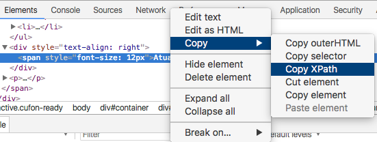

# websiteChecker

This repo comprises of 3 scripts. These were created to run on an Ubuntu 17.10 and python 3.6.3.  
If you are using a version of ubuntu below that, you may need to install a third-party repo as the ubuntu official repository does not support anything above 3.4.0 on most Ubuntus below 17.10.  
For more info, refer to [this script I have for adding the third-party repo](https://github.com/modernNeo/quickRef/blob/master/update_python.sh)
  
## selenium_setup.sh  

Bash script adds the necessary commands and programs to be able to run the websiteChecker.py script  
  
## websiteChecker.py  
  
Python script that has the capability to check a website for a certain text and then email a given person with the results of that check to let the person know if the text has been updated or not  

### Necessary Inputs:  
 * Gmail username
 * [Gmail application-specific password](https://support.google.com/accounts/answer/185833?hl=en)
 * Recipient email
 * Url to check
 * Text to check
 * XPath containing the text to check: [Some documentation by selenium on how to pull information from website](http://www.seleniumhq.org/docs/03_webdriver.jsp)  
   
 #### Extracting an XPath from a Webpage using Chrome' Developer Tools:

  
  
## email_setup.sh  

This is a script I made when I was originally planning on sending an email using a bash command before I moved towards using Python's smtplib so that only 1 script needs to be called for checking the website and emailing the results